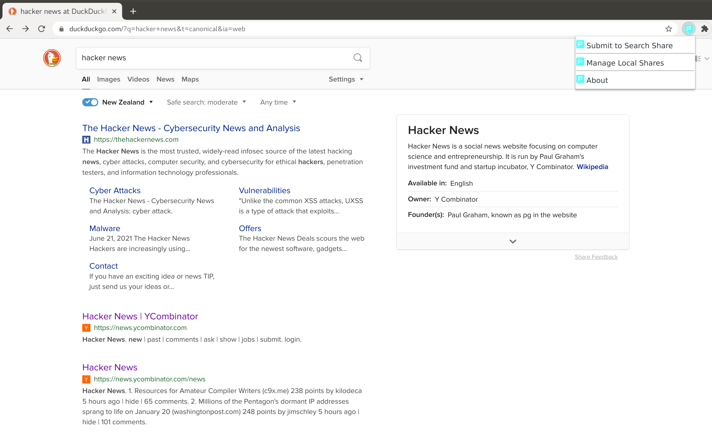
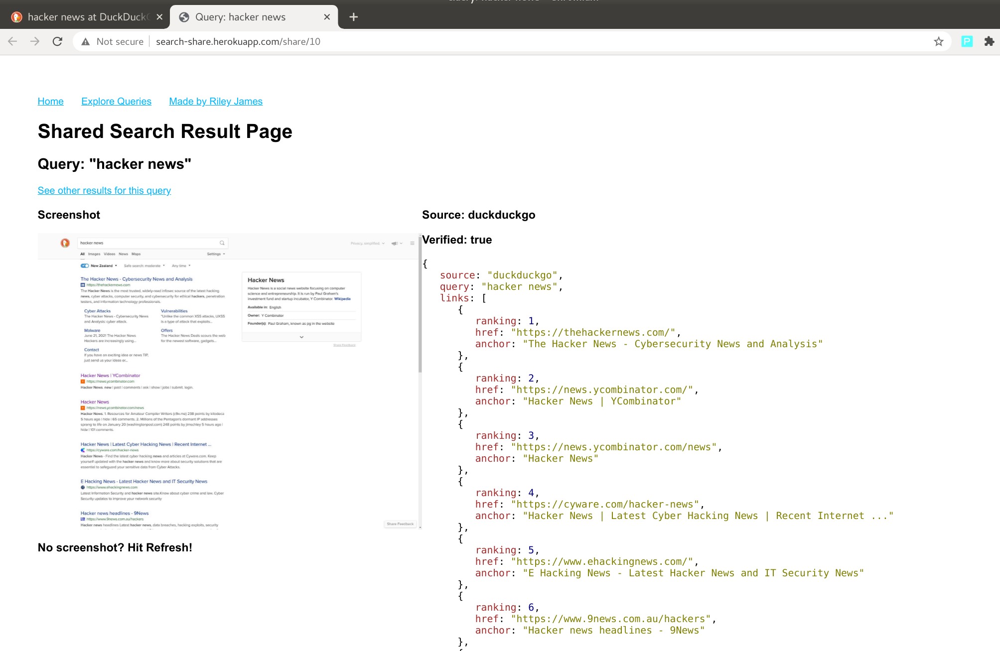

## Search Share Submission How to Guide
Follow this guide to submit search engine results via [Search Share](https://searchshare.proofs.sh)

## Requirements
SearchShare requires installing two extensions, these extensions are only compatible with chromium based browsers.  They have only been tested with Chromium v90 on Ubuntu 18.04.

They should also work on Chrome and other Chromium based browsers on other platforms.  Found a problem? [Submit an issue on Github](https://github.com/rjaus/search-share-extension/issues).

## Setup
1. Clone or download (and extract) the [Search Share extension](https://github.com/rjaus/search-share-extension).
Clone: `clone https://github.com/rjaus/search-share-extension.git`
Download: https://github.com/rjaus/search-share-extension/archive/refs/heads/master.zip 
2. Open Chromium
3. Go to chrome://extensions/ and enable "Developer Mode" (top right hand corner)
4. Click "Load Unpacked"
5. Select the directory where you cloned / extracted the extension
6. Now install the PageSigner Companion app (Chrome App): https://chrome.google.com/webstore/detail/pagesigner-helper-app/oclohfdjoojomkfddjclanpogcnjhemd

## How to submit search results
SearchShare is compatible with the following search engines:
- Google
- DuckDuckGo
- Bing
- Brave Search

Ensure you are **not** logged in when you submit your search results.

1. Go to one of the compatible search engines
2. Enter a query and search, ie ["Hacker news"](https://duckduckgo.com/?q=hacker+news)
3. To submit you search results, click the "P" extension logo, and click the "Submit to Search Share button"

4. Wait... It takes few seconds to notarise and submit your search results
5. When your search results have been submitted, a new tab will be opened and you will be redirected to your shared search results on SearchShare

#### Final result

## **Warning!**
The extension is intended for use with the Share Search.  Please read the [blog post](https://github.com/rjaus/search-share-docs/blob/master/README.md) and ensure you understand how it works before using it.

When "proofing" your search results, you should ensure you are **NOT** logged into your account (google, bing, not sure you can login on DDG or Brave).  In submitting your proof, you are also submitting your TLS session & cookie details, which could enable session hijacking.  There is no need to be logged into your account for the purpose of sharing your search results, but if you accidently do, simply log out and it will destroy your session.

Signed PGSG session are not made public / accessible after they have been submitted.  But you also shouldn't trust random internet strangers!