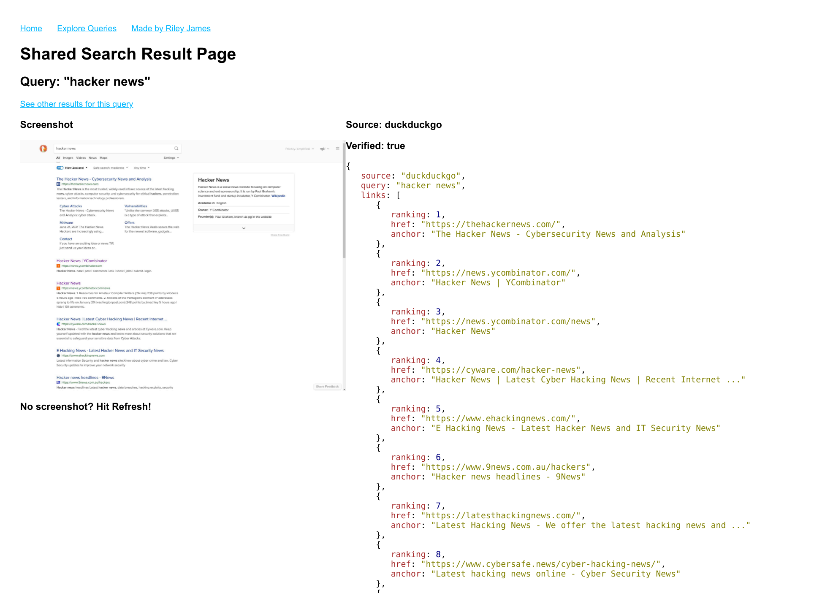
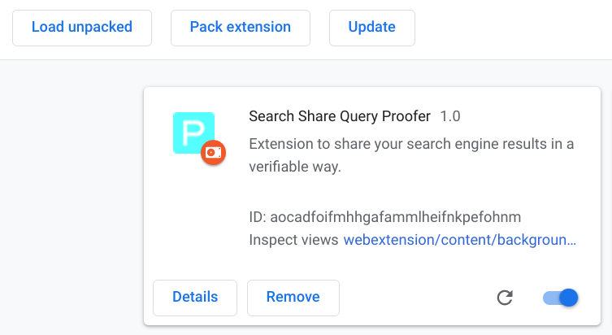

## Digging Deeper
So you don't quite believe this works, and you want to prove it.  Power to you! Lets dig a little deeper into where you could start looking for problems.

### Goal
Try to submit a set of search results, that you have manipulated, and have it validated, parsed & presented by Search Share.

**Note:** Manipulating the screenshot is not relevant, presently screenshots are captured client side, not server side.  They are not part of the 'proof' at this stage (WIP to generate them from the proof on the server side).  They are simply utilised to add a visual component to the service.

More specifically, take the query "Hacker News", on any of the 4 supported search engines and replace the top ranked result with your own website/blog.

Get it successfully submitted, verified & presented.

EG: http://searchshare.proofs.sh/share/10

## Submitting & Generating Search Results
The search extension & chrome app companion are responsible (in conjuction with the remote notary server) for generating the proof, and then submitting it to the SearchShare service.

So to manipulate the proof, you'll want to look at those extensions.

The code for the extension is here: https://github.com/rjaus/search-share-extension

The code for the chrome companion app is here: https://github.com/tlsnotary/pagesigner-chrome-helper-app

If you want to see the debug info when the proof is being generated by the extension, you need to check the console logs for the background page of the extension itself (as opposed to console logs of the page you are creating the proof of)

To access them, open: chrome://extensions/
Then: click "Inspect views" on the background page.

